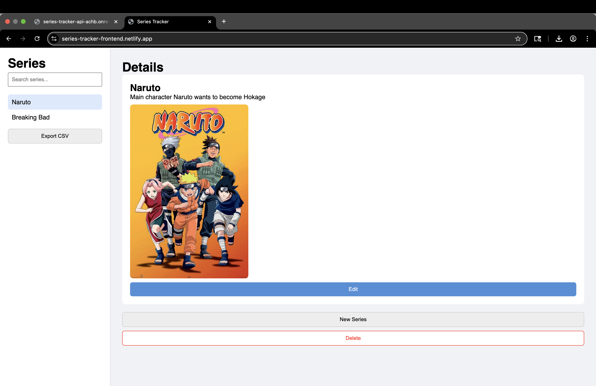

# Series Tracker Frontend

This is the client-side application for the Series Tracker project. It consumes a REST API and allows users to manage TV series through a simple and clean interface.

---

## Backend Repository

https://github.com/alejandro-gperez/series_tracker_backend

---

## Live Demo

Frontend:
https://series-tracker-frontend.netlify.app/

Backend:
https://series-tracker-api-achb.onrender.com

---

## Technologies

- HTML
- CSS
- JavaScript (Vanilla)
- Fetch API

---

## Features

- View all series
- Create new series
- Edit existing series
- Delete series
- Search series by name
- Export series list to CSV
- Image preview using URL
- Responsive and clean UI

---

## How to Run Locally

1. Clone the repository:

```bash
git clone https://github.com/YOUR-USER/series-tracker-frontend.git
cd series-tracker-frontend
```

2. Run a local server:
```bash
python3 -m http.server
```

3. Open your web browser:
`http://localhost:8000`

---

## API Connection

The frontend communicates with the backend using the Fetch API.

Make sure the API URL is correctly set in `app.js`:

```JavaScript
https://series-tracker-api-achb.onrender.com
```

---

## Project Structure

```text
├── index.html
├── styles.css
├── app.js
├── screenshot.png
├── .gitignore
└── README.md
```

---

## Challenges Implemented

- Search input connected to API (?q=)
- Sorting support via API parameters
- CSV export generated in JavaScript
- Full CRUD interface

---

## Screenshot

Main interface showing series list, details panel, buttons and selected series.


---

## Reflection

This project helped me understand how to properly separate frontend and backend responsibilities. The backend exposes a REST API that returns JSON, while the frontend consumes it using vanilla JavaScript and the Fetch API. It also helped me better understand what it means to be a full-stack developer, as I was able to apply concepts learned in my Database and Software Engineering courses in a practical scenario.

Working without frameworks made it easier to understand how HTTP requests, DOM manipulation, and state handling work under the hood. I would use this architecture again because it is flexible, scalable, and allows different types of clients to consume the same API.

---

## Notes

- The frontend does not interact directly with the database.
- All data operations are handled through the backend API.
- Images are loaded using external URLs provided by the user.
